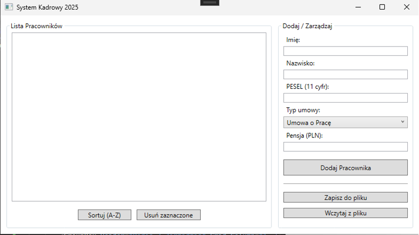
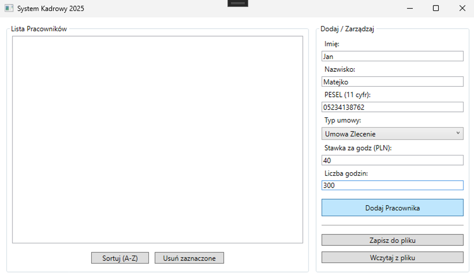
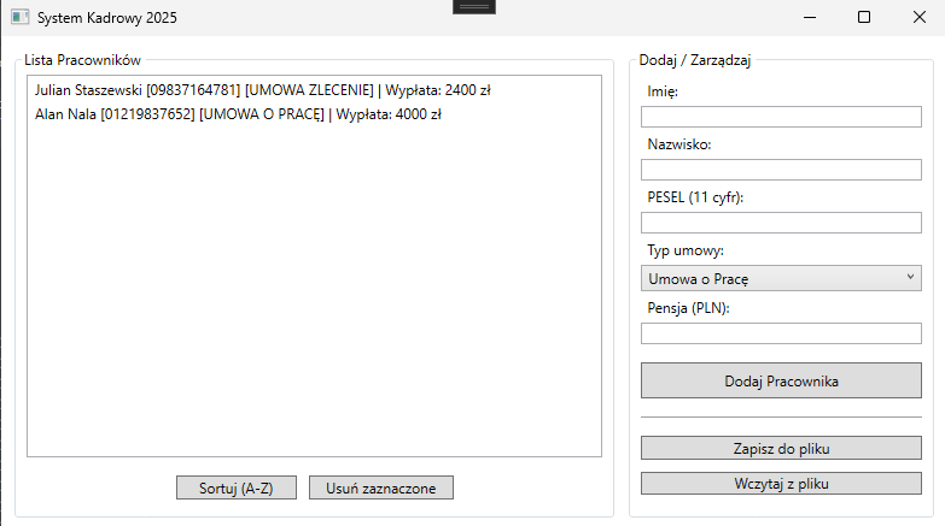

# System Ewidencji Pracowników i Obliczania Wynagrodzeń 💼

**Projekt zaliczeniowy: Programowanie Obiektowe** **Rok akademicki:** 2025/2026  
**Technologia:** C# / WPF / .NET 6.0

## 📖 O projekcie

Aplikacja typu Desktop (WPF) służąca do obsługi działu kadr w małym przedsiębiorstwie. System umożliwia ewidencjonowanie pracowników różnych typów (etatowych oraz zleceniobiorców), automatyczne obliczanie ich wynagrodzeń zgodnie z typem umowy oraz trwały zapis danych w formacie JSON.

Głównym celem projektowym było praktyczne zastosowanie paradygmatów **programowania obiektowego**, takich jak:
- Dziedziczenie i Polimorfizm
- Hermetyzacja danych
- Obsługa wyjątków
- Interfejsy

### Kluczowe funkcjonalności
* ✅ **Ewidencja pracowników:** Dodawanie pracowników na Umowę o Pracę i Umowę Zlecenie.
* ✅ **Inteligentne formularze:** Dynamiczne dostosowanie pól w zależności od wybranego typu umowy.
* ✅ **Polimorficzne obliczenia:** Automatyczne wyliczanie pensji (netto/brutto/godzinowe) w zależności od klasy pracownika.
* ✅ **Persystencja danych:** Zapis i odczyt bazy pracowników z pliku `baza.json`.
* ✅ **Sortowanie i Walidacja:** Sortowanie alfabetyczne oraz weryfikacja poprawności PESEL (11 cyfr) i stawek.

---

## 👥 Zespół Projektowy

| Imię i Nazwisko | Rola | Odpowiedzialność |
| :--- | :--- | :--- |
| **Kamil Celadyn** | Backend Developer | Abstrakcyjna logika biznesowa (`Pracownik`, `SystemKadrowy`), dziedziczenie, polimorfizm, serializacja JSON. |
| **Oskar Fryc** | Frontend Developer | Interfejs graficzny (WPF/XAML), logika interakcji użytkownika, obsługa zdarzeń i binding danych. |
| **Mykhailo Bondar** | QA & Docs | Obsługa błędów (`KadryException`), interfejsy (`IBonusowalny`), Diagram UML oraz dokumentacja techniczna. |

---

## 🏗 Architektura i Diagram UML

Projekt został zaprojektowany z zachowaniem podziału na logikę biznesową i warstwę prezentacji.

### Opis najważniejszych klas:

1.  **`Pracownik` (Klasa Abstrakcyjna)** Fundament systemu. Definiuje wspólne cechy (Imię, Nazwisko, PESEL). Wymusza implementację metody `ObliczPensje()` na klasach pochodnych. Implementuje interfejsy `IComparable` (do sortowania) i `IEquatable`.

2.  **`PracownikEtatowy` i `Zleceniobiorca`** Klasy dziedziczące po `Pracownik`. `PracownikEtatowy` implementuje dodatkowo interfejs `IBonusowalny` (premie), a `Zleceniobiorca` wylicza pensję na podstawie stawki godzinowej.

3.  **`SystemKadrowy` (Logika)** Klasa zarządzająca kolekcją `List<Pracownik>`. Odpowiada za dodawanie (z walidacją duplikatów), usuwanie oraz serializację danych.

4.  **`KadryException`** Własna klasa wyjątków służąca do precyzyjnego raportowania błędów logiki biznesowej użytkownikowi.

---

## 🚀 Instrukcja Obsługi

### Wymagania
* System operacyjny Windows
* Zainstalowane środowisko .NET Runtime 6.0 (lub nowsze)

### Szybki start
1.  Uruchom plik `SystemWynagrodzen.exe`.
2.  **Dodawanie:** W panelu po prawej stronie wypełnij dane.
    * Wybierz *Typ umowy*.
    * Dla **Umowy o Pracę** wpisz pensję miesięczną.
    * Dla **Umowy Zlecenie** wpisz stawkę za godzinę i liczbę godzin.
3.  Kliknij **Dodaj Pracownika**.
4.  **Zapis:** Aby zachować dane, kliknij "Zapisz do pliku".

### Rozwiązywanie problemów

| Objaw | Przyczyna | Rozwiązanie |
| :--- | :--- | :--- |
| Komunikat: *"PESEL musi składać się z 11 cyfr!"* | Wpisano za krótki/długi numer. | Sprawdź długość numeru PESEL. |
| Komunikat: *"Pensja nie może być ujemna!"* | Wpisano wartość ujemną. | Wpisz kwotę dodatnią. |
| Program nie wczytuje danych | Brak pliku `baza.json`. | Upewnij się, że wcześniej użyto przycisku "Zapisz". |

---
&copy; 2025 Zespół Projektowy. Wszelkie prawa zastrzeżone.
